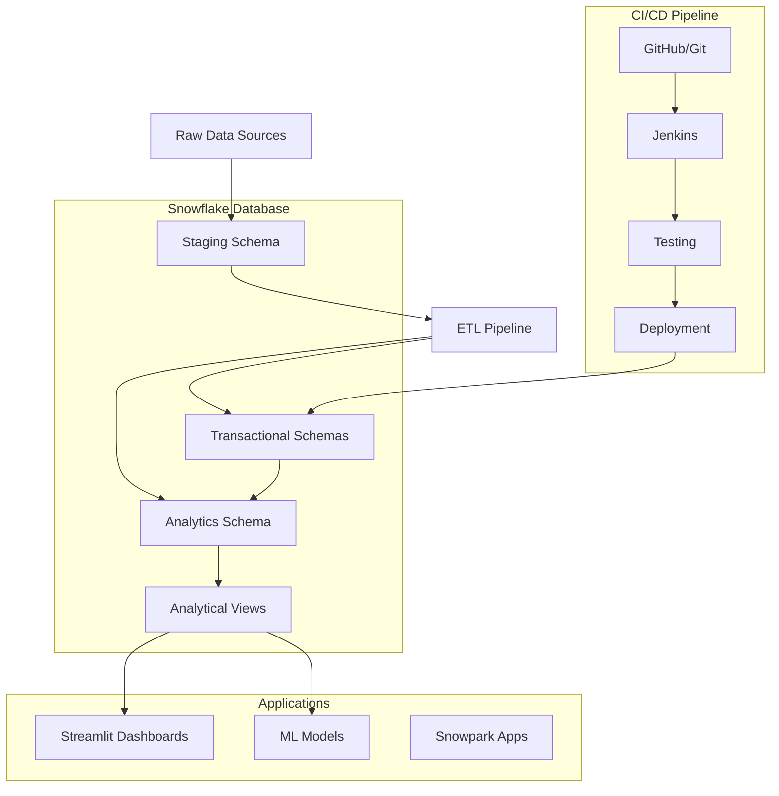

# RetailWorks - Snowflake Enterprise Data Platform


A comprehensive Snowflake-based enterprise data platform featuring modern data engineering practices, automated CI/CD pipelines, interactive analytics dashboards, and sample data generation. Built with production-ready architecture and comprehensive testing.

## 🏗️ Architecture Overview



## 📁 Project Structure

```
retailworks-snowflake/
├── ddl/                          # Database Definition Language scripts
│   ├── schemas/                  # Database and schema creation
│   ├── tables/                   # Table definitions by schema
│   ├── views/                    # Analytical views
│   └── procedures/               # Stored procedures
├── dml/                          # Data Manipulation Language scripts
│   ├── sample_data/              # Sample data generation
│   └── migrations/               # Data migration scripts
├── snowpark/                     # Snowpark applications
│   ├── src/                      # Source code
│   │   ├── etl_pipeline.py       # ETL data processing
│   │   └── ml_models.py          # Machine learning models
│   ├── tests/                    # Unit tests
│   └── requirements.txt          # Python dependencies
├── streamlit/                    # Streamlit dashboards
│   ├── dashboards/               # Dashboard applications
│   │   ├── executive_dashboard.py
│   │   └── sales_dashboard.py
│   ├── utils/                    # Utility functions
│   └── config/                   # Configuration files
├── jenkins/                      # CI/CD pipeline
│   ├── Jenkinsfile              # Pipeline definition
│   └── deployment/              # Deployment scripts
└── docs/                        # Documentation
```

## 🎯 Features

### 📊 Data Platform
- **Multi-Schema Architecture**: Organized data across Sales, Products, Customers, HR, Analytics, and Staging schemas
- **Dimensional Modeling**: Star schema implementation for optimal analytical performance
- **Data Quality**: Built-in validation rules and quality monitoring
- **Scalable Design**: Supports growing data volumes and concurrent users

### 🔄 ETL Pipeline
- **Snowpark Integration**: Python-based data processing using Snowflake's native framework
- **Data Validation**: Comprehensive data quality checks and cleansing
- **Error Handling**: Robust error handling and logging
- **Incremental Loading**: Support for both full and incremental data loads

### 📈 Analytics & Dashboards
- **Executive Dashboard**: High-level KPIs and business metrics
- **Sales Dashboard**: Detailed sales analytics and performance tracking
- **Interactive Visualizations**: Built with Plotly and Streamlit
- **Real-time Data**: Direct connection to Snowflake for live updates

### 🤖 Machine Learning
- **Customer Lifetime Value**: Predictive models for customer value
- **Churn Prediction**: Identify customers at risk of churning
- **Sales Forecasting**: Time series forecasting for sales planning

### 🚀 DevOps & CI/CD
- **Automated Testing**: Comprehensive test suite for database and applications
- **Multi-Environment**: Support for dev, test, and production environments
- **Schema Deployment**: Independent schema deployment capabilities
- **Quality Gates**: Automated code quality checks and validation

## 🛠️ Installation & Setup

### Prerequisites
- Snowflake account with appropriate permissions
- Python 3.11 or higher
- UV package manager (recommended) or pip
- Git

### 1. Clone Repository
```bash
git clone https://github.com/your-org/retailworks-snowflake.git
cd retailworks-snowflake
```

### 2. Install UV Package Manager
```bash
# Install UV (fast Python package manager)
curl -LsSf https://astral.sh/uv/install.sh | sh
# or pip install uv
```

### 3. Environment Setup
```bash
# Install dependencies with UV
uv sync

# Alternative: Traditional pip approach
python -m venv venv
source venv/bin/activate  # On Windows: venv\Scripts\activate
pip install -r requirements.txt
```

### 4. Snowflake Configuration

#### Option A: Environment Variables (Recommended)
Create a `.env` file in the project root:
```bash
SNOWFLAKE_ACCOUNT="your_account.region"
SNOWFLAKE_USER="your_username"
SNOWFLAKE_PASSWORD="your_password"
SNOWFLAKE_ROLE="your_role"
SNOWFLAKE_WAREHOUSE="your_warehouse"
SNOWFLAKE_DATABASE="RETAILWORKS_DB_DEV"
SNOWFLAKE_SCHEMA="PUBLIC"
```

#### Option B: Streamlit Secrets
Create a `.streamlit/secrets.toml` file:
```toml
[snowflake]
account = "your_account.region"
user = "your_username"
password = "your_password"
role = "your_role"
warehouse = "your_warehouse"
database = "RETAILWORKS_DB_DEV"
schema = "ANALYTICS_SCHEMA_DEV"
```

### 5. Database Schema Deployment
```bash
# Deploy all schemas and tables (run in Snowflake worksheet)
# Copy and execute: ddl/schemas/01_create_database.sql
# Copy and execute: ddl/tables/*.sql files

# Or use deployment scripts:
uv run python jenkins/deployment/deploy_schemas.py --environment dev
uv run python jenkins/deployment/deploy_tables.py --environment dev
```

### 6. Sample Data Generation & Loading
```bash
# Generate sample data (CSV files)
uv run python dml/sample_data/generate_sample_data.py

# Load sample data to Snowflake
uv run python dml/sample_data/load_large_data.py

# Verify data loading
uv run python dml/sample_data/verify_data_load.py
```

### 7. Quick Start Verification
```bash
# Test Snowflake connection
uv run python streamlit/utils/snowflake_connection.py

# Run basic tests
uv run pytest snowpark/tests/test_data_quality.py -v

# Start dashboard
uv run streamlit run streamlit/dashboards/executive_dashboard.py
```

## 🚀 Usage

### Running Dashboards
```bash
# Executive Dashboard
uv run streamlit run streamlit/dashboards/executive_dashboard.py

# Sales Dashboard  
uv run streamlit run streamlit/dashboards/sales_dashboard.py
```

### ETL Pipeline
```bash
# Run ETL data processing
uv run python snowpark/src/etl_pipeline.py

# Run data quality validation
uv run python snowpark/src/data_quality_validator.py
```

### Machine Learning Models
```bash
# Train ML models
uv run python snowpark/src/ml_models.py
```

### Sample Data Operations
```bash
# Generate fresh sample data
uv run python dml/sample_data/generate_sample_data.py

# Load sample data to Snowflake
uv run python dml/sample_data/load_large_data.py

# Show data locations
uv run python dml/sample_data/show_loaded_data_locations.py
```

## 🧪 Testing

### Run All Tests
```bash
# Run comprehensive data quality tests
uv run pytest snowpark/tests/test_data_quality.py -v

# Run all tests with coverage
uv run pytest --cov=snowpark --cov-report=html

# Run specific test categories
uv run pytest -m unit        # Unit tests only
uv run pytest -m integration # Integration tests only  
uv run pytest -m performance # Performance tests only
uv run pytest -m smoke      # Smoke tests only

# Run tests for specific environment
export SNOWFLAKE_DATABASE=RETAILWORKS_DB_DEV
uv run pytest --environment=dev
```

### Test Categories
- **Unit Tests**: Test individual components and functions
- **Integration Tests**: Test component interactions and data flows
- **Data Quality Tests**: Validate data integrity, completeness, and business rules
- **Performance Tests**: Monitor query performance and resource usage
- **Smoke Tests**: Basic connectivity and functionality validation

### Current Test Coverage
- **Schema Validation**: ✅ All schemas and tables existence
- **Data Quality**: ✅ Completeness, integrity, and business rules
- **Referential Integrity**: ✅ Foreign key relationships
- **Performance**: ✅ Query execution time validation
- **Data Volumes**: ✅ Expected data volume ranges

## 📊 Database Schema & Sample Data

### Sample Data Overview

The project includes a comprehensive sample dataset with **56,317+ records** across multiple schemas:

```sql
-- Database: RETAILWORKS_DB_DEV
-- Sample Data Locations:

-- CUSTOMERS_SCHEMA_DEV (Customer Data)
SELECT * FROM CUSTOMERS_SCHEMA_DEV.CUSTOMERS;          -- 50,000 customers
SELECT * FROM CUSTOMERS_SCHEMA_DEV.CUSTOMER_SEGMENTS;  -- 6 customer segments

-- PRODUCTS_SCHEMA_DEV (Product Catalog)  
SELECT * FROM PRODUCTS_SCHEMA_DEV.PRODUCTS;           -- 5,000 products
SELECT * FROM PRODUCTS_SCHEMA_DEV.CATEGORIES;         -- 12 categories
SELECT * FROM PRODUCTS_SCHEMA_DEV.SUPPLIERS;          -- 200 suppliers

-- HR_SCHEMA_DEV (Human Resources)
SELECT * FROM HR_SCHEMA_DEV.DEPARTMENTS;              -- 10 departments
SELECT * FROM HR_SCHEMA_DEV.POSITIONS;                -- 15 positions

-- ANALYTICS_SCHEMA_DEV (Data Warehouse)
SELECT * FROM ANALYTICS_SCHEMA_DEV.DATE_DIM;          -- 1,095 dates (3 years)
```

### Data Generation Features
- **Realistic Data**: Uses Faker library for realistic customer/supplier data
- **Referential Integrity**: All foreign key relationships maintained
- **Business Rules**: Data follows realistic business constraints
- **Configurable Volumes**: Easily adjust data volumes for testing
- **Multiple Formats**: Supports CSV export and direct Snowflake loading

### Core Schemas

#### Sales Schema
- `ORDERS` - Customer orders and order headers
- `ORDER_ITEMS` - Individual line items within orders
- `SALES_TERRITORIES` - Geographic sales regions
- `SALES_REPS` - Sales representative information

#### Products Schema
- `PRODUCTS` - Product catalog with pricing and details
- `CATEGORIES` - Product categorization hierarchy
- `SUPPLIERS` - Supplier information and contacts
- `INVENTORY` - Stock levels and inventory tracking

#### Customers Schema
- `CUSTOMERS` - Customer master data
- `ADDRESSES` - Customer addresses (billing/shipping)
- `CUSTOMER_SEGMENTS` - Market segmentation definitions
- `CUSTOMER_ADDRESSES` - Address relationship mapping

#### HR Schema
- `EMPLOYEES` - Employee master data
- `DEPARTMENTS` - Organizational structure
- `POSITIONS` - Job positions and roles
- `PAYROLL` - Compensation and payroll data

#### Analytics Schema
- `DATE_DIM` - Date dimension table
- `CUSTOMER_DIM` - Customer dimension (SCD Type 2)
- `PRODUCT_DIM` - Product dimension (SCD Type 2)
- `SALES_FACT` - Sales fact table
- `CUSTOMER_LTV_FACT` - Customer lifetime value metrics

## 🔧 CI/CD Pipeline

### GitHub Actions Workflow

The project includes a comprehensive CI/CD pipeline using GitHub Actions with multi-environment support:

```yaml
# .github/workflows/ci-cd-pipeline.yml
name: RetailWorks Snowflake CI/CD Pipeline

on:
  push:
    branches: [ main, develop ]
  pull_request:
    branches: [ main ]
```

### Pipeline Stages

#### 1. **Test Stage** (Runs on all branches)
- Schema validation tests
- Data quality tests  
- Unit and integration tests
- Security scanning
- Code quality checks

#### 2. **Development Deployment** (Auto on `develop` branch)
- Deploy to `RETAILWORKS_DB_DEV`
- Load sample data
- Run post-deployment tests
- Performance validation

#### 3. **Staging Deployment** (Auto on `main` branch)
- Deploy to `RETAILWORKS_DB_STAGING`
- Integration testing
- Performance benchmarking
- User acceptance testing

#### 4. **Production Deployment** (Manual approval required)
- Deploy to `RETAILWORKS_DB`
- Smoke tests
- Monitoring setup
- Release creation

### Environment Configuration

#### Required GitHub Secrets
```bash
SNOWFLAKE_ACCOUNT      # your-account.region
SNOWFLAKE_USER         # ci-cd-service-user
SNOWFLAKE_PASSWORD     # secure-password
SNOWFLAKE_ROLE         # deployment-role
SNOWFLAKE_WAREHOUSE    # deployment-warehouse
```

#### Environment-Specific Databases
- **Development**: `RETAILWORKS_DB_DEV`
- **Staging**: `RETAILWORKS_DB_STAGING`  
- **Production**: `RETAILWORKS_DB`

### Local CI/CD Testing
```bash
# Run tests locally (same as CI)
uv run pytest snowpark/tests/ -v

# Test deployment scripts
uv run python jenkins/deployment/deploy_schemas.py --environment dev --dry-run

# Security scan
uv run bandit -r snowpark/ -f json
```

## 🔐 Security & Permissions

### Role-Based Access Control
- **Admin Roles**: Full access to all schemas and operations
- **Developer Roles**: Read/write access for development
- **Analyst Roles**: Read-only access to analytics schemas
- **Business User Roles**: Dashboard and report access only

### Data Protection
- **Column-Level Security**: Sensitive data masking
- **Row-Level Security**: Data access based on user context
- **Audit Logging**: Complete audit trail for all data access
- **Encryption**: Data encrypted at rest and in transit

## 📈 Performance Optimization

### Query Optimization
- **Clustering Keys**: Optimized data clustering for frequent queries
- **Materialized Views**: Pre-computed aggregations for dashboards
- **Result Caching**: Snowflake result caching for repeated queries
- **Warehouse Sizing**: Right-sized compute resources

### Data Loading
- **Bulk Loading**: Optimized bulk data loading processes
- **Parallel Processing**: Multi-threaded data processing
- **Incremental Updates**: Efficient change data capture
- **Compression**: Optimized data compression strategies

## 🤝 Contributing

### Development Workflow
1. Fork the repository
2. Create a feature branch (`git checkout -b feature/amazing-feature`)
3. Make your changes
4. Add tests for new functionality
5. Run the test suite (`pytest`)
6. Commit your changes (`git commit -m 'Add amazing feature'`)
7. Push to the branch (`git push origin feature/amazing-feature`)
8. Open a Pull Request

### Code Standards
- **Python**: Follow PEP 8 style guidelines
- **SQL**: Use consistent formatting and naming conventions
- **Testing**: Maintain >80% code coverage
- **Documentation**: Update docs for all new features

## 📚 Documentation

### Available Documentation
- [CI/CD Deployment Guide](docs/ci-cd-deployment-guide.md) - Complete CI/CD pipeline setup and configuration
- [Testing Guide](docs/testing-guide.md) - Comprehensive testing strategy and framework
- [Sample Data Loading Guide](dml/sample_data/README_data_loading.md) - Data generation and loading procedures
- [Snowflake DevOps Guide](docs/snowflake_devops_guide.md) - DevOps best practices
- [Deployment Guide](docs/deployment_guide.md) - Manual deployment procedures
- [Database Schema Guide](docs/database_schema.md) - Schema design and structure
- [ETL Pipeline Documentation](docs/etl_pipeline.md) - Data processing workflows
- [Dashboard User Guide](docs/dashboard_guide.md) - Dashboard usage and configuration
- [Troubleshooting Guide](docs/troubleshooting.md) - Common issues and solutions

### API Documentation
- **Snowpark APIs**: Data processing and ML model APIs
- **Dashboard APIs**: Dashboard configuration and data APIs
- **ETL APIs**: Data pipeline and quality monitoring APIs
- **Testing APIs**: Test framework and data quality validation APIs

### Quick Reference
- **Environment Setup**: See [Installation & Setup](#🛠️-installation--setup)
- **Sample Data**: See [Database Schema & Sample Data](#📊-database-schema--sample-data)  
- **CI/CD Pipeline**: See [CI/CD Pipeline](#🔧-cicd-pipeline)
- **Testing**: See [Testing](#🧪-testing)

## 🐛 Troubleshooting

### Common Issues

#### Connection Issues
```bash
# Test Snowflake connection
python streamlit/utils/snowflake_connection.py
```

#### Dashboard Issues
```bash
# Check Streamlit configuration
streamlit config show

# Clear Streamlit cache
streamlit cache clear
```

#### ETL Pipeline Issues
```bash
# Check ETL logs
tail -f logs/etl_pipeline.log

# Validate data quality
python snowpark/src/data_quality_validator.py
```

## 📄 License

This project is licensed under the MIT License - see the [LICENSE](LICENSE) file for details.

## 🙏 Acknowledgments

- **Snowflake**: For providing the cloud data platform
- **Microsoft AdventureWorks**: For inspiration and sample data concepts
- **Streamlit**: For the interactive dashboard framework
- **Jenkins**: For CI/CD automation capabilities

## 📞 Support

- **Issues**: Report bugs and feature requests via [GitHub Issues](https://github.com/your-org/retailworks-snowflake/issues)
- **Discussions**: Join the conversation in [GitHub Discussions](https://github.com/your-org/retailworks-snowflake/discussions)
- **Documentation**: Check the [Wiki](https://github.com/your-org/retailworks-snowflake/wiki) for detailed guides

---

## 🏆 Project Statistics


**Built with ❤️ by the RetailWorks Team**