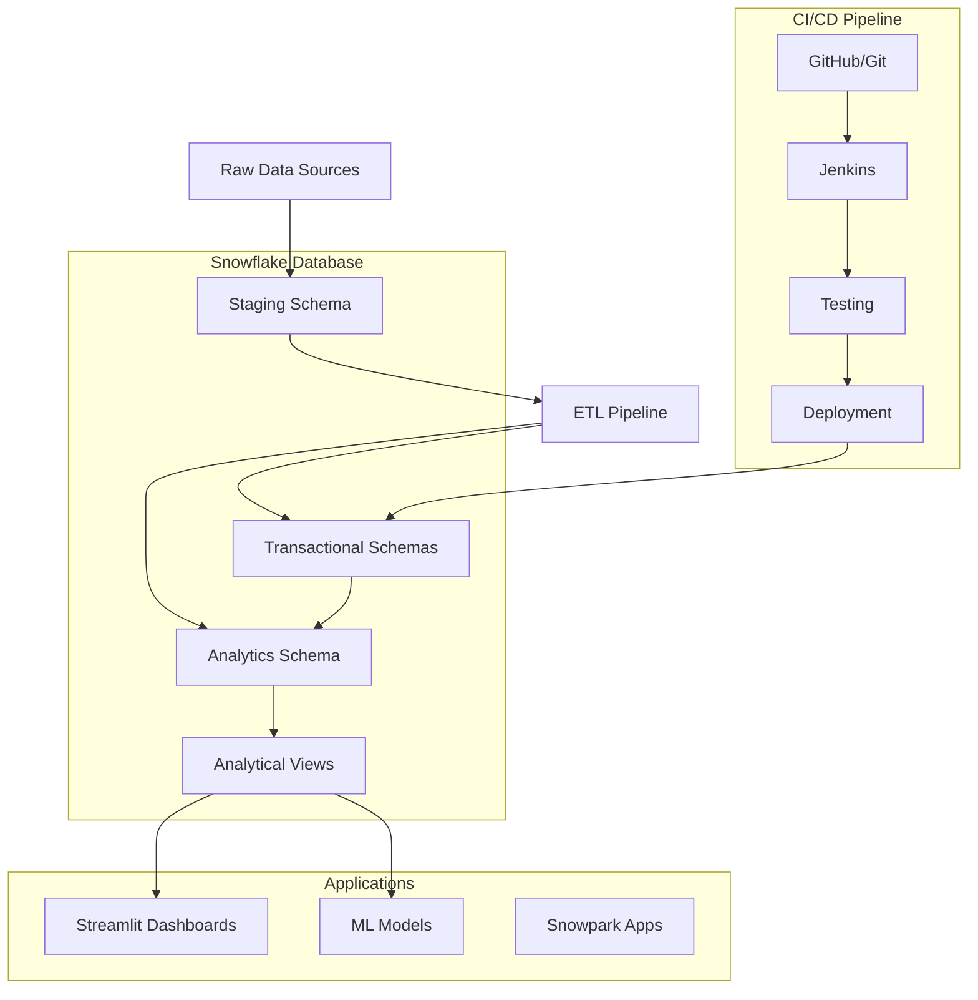

# RetailWorks - Snowflake Enterprise Data Platform


A comprehensive Snowflake-based enterprise data platform inspired by Microsoft's AdventureWorks, featuring modern data engineering practices, automated CI/CD pipelines, and interactive analytics dashboards.

## 🏗️ Architecture Overview



## 📁 Project Structure

```
retailworks-snowflake/
├── ddl/                          # Database Definition Language scripts
│   ├── schemas/                  # Database and schema creation
│   ├── tables/                   # Table definitions by schema
│   ├── views/                    # Analytical views
│   └── procedures/               # Stored procedures
├── dml/                          # Data Manipulation Language scripts
│   ├── sample_data/              # Sample data generation
│   └── migrations/               # Data migration scripts
├── snowpark/                     # Snowpark applications
│   ├── src/                      # Source code
│   │   ├── etl_pipeline.py       # ETL data processing
│   │   └── ml_models.py          # Machine learning models
│   ├── tests/                    # Unit tests
│   └── requirements.txt          # Python dependencies
├── streamlit/                    # Streamlit dashboards
│   ├── dashboards/               # Dashboard applications
│   │   ├── executive_dashboard.py
│   │   └── sales_dashboard.py
│   ├── utils/                    # Utility functions
│   └── config/                   # Configuration files
├── jenkins/                      # CI/CD pipeline
│   ├── Jenkinsfile              # Pipeline definition
│   └── deployment/              # Deployment scripts
└── docs/                        # Documentation
```

## 🎯 Features

### 📊 Data Platform
- **Multi-Schema Architecture**: Organized data across Sales, Products, Customers, HR, Analytics, and Staging schemas
- **Dimensional Modeling**: Star schema implementation for optimal analytical performance
- **Data Quality**: Built-in validation rules and quality monitoring
- **Scalable Design**: Supports growing data volumes and concurrent users

### 🔄 ETL Pipeline
- **Snowpark Integration**: Python-based data processing using Snowflake's native framework
- **Data Validation**: Comprehensive data quality checks and cleansing
- **Error Handling**: Robust error handling and logging
- **Incremental Loading**: Support for both full and incremental data loads

### 📈 Analytics & Dashboards
- **Executive Dashboard**: High-level KPIs and business metrics
- **Sales Dashboard**: Detailed sales analytics and performance tracking
- **Interactive Visualizations**: Built with Plotly and Streamlit
- **Real-time Data**: Direct connection to Snowflake for live updates

### 🤖 Machine Learning
- **Customer Lifetime Value**: Predictive models for customer value
- **Churn Prediction**: Identify customers at risk of churning
- **Sales Forecasting**: Time series forecasting for sales planning

### 🚀 DevOps & CI/CD
- **Automated Testing**: Comprehensive test suite for database and applications
- **Multi-Environment**: Support for dev, test, and production environments
- **Schema Deployment**: Independent schema deployment capabilities
- **Quality Gates**: Automated code quality checks and validation

## 🛠️ Installation & Setup

### Prerequisites
- Snowflake account with appropriate permissions
- Python 3.8 or higher
- Git
- Jenkins (for CI/CD)

### 1. Clone Repository
```bash
git clone https://github.com/your-org/retailworks-snowflake.git
cd retailworks-snowflake
```

### 2. Environment Setup
```bash
# Create Python virtual environment
python -m venv venv
source venv/bin/activate  # On Windows: venv\Scripts\activate

# Install dependencies
pip install -r snowpark/requirements.txt
```

### 3. Snowflake Configuration
Create a `.streamlit/secrets.toml` file:
```toml
[snowflake]
account = "your_account_identifier"
user = "your_username"
password = "your_password"
role = "your_role"
warehouse = "your_warehouse"
database = "RETAILWORKS_DB"
schema = "ANALYTICS_SCHEMA"
```

### 4. Database Deployment
```bash
# Deploy schemas
python jenkins/deployment/deploy_schemas.py \
    --environment dev \
    --account your_account \
    --user your_user \
    --password your_password \
    --role your_role \
    --warehouse your_warehouse \
    --database RETAILWORKS_DB

# Deploy tables
python jenkins/deployment/deploy_tables.py \
    --schema all \
    --environment dev \
    --account your_account \
    --user your_user \
    --password your_password \
    --role your_role \
    --warehouse your_warehouse \
    --database RETAILWORKS_DB
```

### 5. Sample Data Generation
```bash
cd dml/sample_data
python generate_sample_data.py
```

## 🚀 Usage

### Running Dashboards
```bash
# Executive Dashboard
streamlit run streamlit/dashboards/executive_dashboard.py

# Sales Dashboard
streamlit run streamlit/dashboards/sales_dashboard.py
```

### ETL Pipeline
```bash
cd snowpark/src
python etl_pipeline.py
```

### Machine Learning Models
```bash
cd snowpark/src
python ml_models.py
```

## 🧪 Testing

### Run All Tests
```bash
# Database tests
python -m pytest snowpark/tests/test_database.py -v

# ETL tests
python -m pytest snowpark/tests/test_etl.py -v

# Generate coverage report
python -m pytest --cov=snowpark/src --cov-report=html
```

### Test Categories
- **Unit Tests**: Test individual components and functions
- **Integration Tests**: Test component interactions
- **Database Tests**: Validate schema structure and data integrity
- **Performance Tests**: Monitor query performance and resource usage

## 📊 Database Schema

### Core Schemas

#### Sales Schema
- `ORDERS` - Customer orders and order headers
- `ORDER_ITEMS` - Individual line items within orders
- `SALES_TERRITORIES` - Geographic sales regions
- `SALES_REPS` - Sales representative information

#### Products Schema
- `PRODUCTS` - Product catalog with pricing and details
- `CATEGORIES` - Product categorization hierarchy
- `SUPPLIERS` - Supplier information and contacts
- `INVENTORY` - Stock levels and inventory tracking

#### Customers Schema
- `CUSTOMERS` - Customer master data
- `ADDRESSES` - Customer addresses (billing/shipping)
- `CUSTOMER_SEGMENTS` - Market segmentation definitions
- `CUSTOMER_ADDRESSES` - Address relationship mapping

#### HR Schema
- `EMPLOYEES` - Employee master data
- `DEPARTMENTS` - Organizational structure
- `POSITIONS` - Job positions and roles
- `PAYROLL` - Compensation and payroll data

#### Analytics Schema
- `DATE_DIM` - Date dimension table
- `CUSTOMER_DIM` - Customer dimension (SCD Type 2)
- `PRODUCT_DIM` - Product dimension (SCD Type 2)
- `SALES_FACT` - Sales fact table
- `CUSTOMER_LTV_FACT` - Customer lifetime value metrics

## 🔧 CI/CD Pipeline

### Pipeline Stages
1. **Checkout** - Source code retrieval
2. **Environment Setup** - Python dependencies and tools
3. **Code Quality** - SQL linting and Python code quality checks
4. **Build Validation** - Artifact validation
5. **Schema Deployment** - Database schema deployment
6. **Table Deployment** - Table structure deployment
7. **Data Deployment** - Sample data loading (optional)
8. **Testing** - Automated test execution
9. **Verification** - Deployment validation

### Environment Support
- **Development** - Full feature development with relaxed validation
- **Test** - Integration testing with performance monitoring
- **Production** - Strict validation and approval gates

### Jenkins Configuration
```groovy
pipeline {
    agent any
    parameters {
        choice(name: 'DEPLOYMENT_ENVIRONMENT', choices: ['dev', 'test', 'prod'])
        choice(name: 'SCHEMA_TO_DEPLOY', choices: ['all', 'sales', 'products', 'customers', 'hr', 'analytics'])
        booleanParam(name: 'RUN_TESTS', defaultValue: true)
    }
    // ... (see Jenkinsfile for complete configuration)
}
```

## 🔐 Security & Permissions

### Role-Based Access Control
- **Admin Roles**: Full access to all schemas and operations
- **Developer Roles**: Read/write access for development
- **Analyst Roles**: Read-only access to analytics schemas
- **Business User Roles**: Dashboard and report access only

### Data Protection
- **Column-Level Security**: Sensitive data masking
- **Row-Level Security**: Data access based on user context
- **Audit Logging**: Complete audit trail for all data access
- **Encryption**: Data encrypted at rest and in transit

## 📈 Performance Optimization

### Query Optimization
- **Clustering Keys**: Optimized data clustering for frequent queries
- **Materialized Views**: Pre-computed aggregations for dashboards
- **Result Caching**: Snowflake result caching for repeated queries
- **Warehouse Sizing**: Right-sized compute resources

### Data Loading
- **Bulk Loading**: Optimized bulk data loading processes
- **Parallel Processing**: Multi-threaded data processing
- **Incremental Updates**: Efficient change data capture
- **Compression**: Optimized data compression strategies

## 🤝 Contributing

### Development Workflow
1. Fork the repository
2. Create a feature branch (`git checkout -b feature/amazing-feature`)
3. Make your changes
4. Add tests for new functionality
5. Run the test suite (`pytest`)
6. Commit your changes (`git commit -m 'Add amazing feature'`)
7. Push to the branch (`git push origin feature/amazing-feature`)
8. Open a Pull Request

### Code Standards
- **Python**: Follow PEP 8 style guidelines
- **SQL**: Use consistent formatting and naming conventions
- **Testing**: Maintain >80% code coverage
- **Documentation**: Update docs for all new features

## 📚 Documentation

### Available Documentation
- [Database Schema Guide](docs/database_schema.md)
- [ETL Pipeline Documentation](docs/etl_pipeline.md)
- [Dashboard User Guide](docs/dashboard_guide.md)
- [API Reference](docs/api_reference.md)
- [Deployment Guide](docs/deployment_guide.md)
- [Troubleshooting Guide](docs/troubleshooting.md)

### API Documentation
- **Snowpark APIs**: Data processing and ML model APIs
- **Dashboard APIs**: Dashboard configuration and data APIs
- **ETL APIs**: Data pipeline and quality monitoring APIs

## 🐛 Troubleshooting

### Common Issues

#### Connection Issues
```bash
# Test Snowflake connection
python streamlit/utils/snowflake_connection.py
```

#### Dashboard Issues
```bash
# Check Streamlit configuration
streamlit config show

# Clear Streamlit cache
streamlit cache clear
```

#### ETL Pipeline Issues
```bash
# Check ETL logs
tail -f logs/etl_pipeline.log

# Validate data quality
python snowpark/src/data_quality_validator.py
```

## 📄 License

This project is licensed under the MIT License - see the [LICENSE](LICENSE) file for details.

## 🙏 Acknowledgments

- **Snowflake**: For providing the cloud data platform
- **Microsoft AdventureWorks**: For inspiration and sample data concepts
- **Streamlit**: For the interactive dashboard framework
- **Jenkins**: For CI/CD automation capabilities

## 📞 Support

- **Issues**: Report bugs and feature requests via [GitHub Issues](https://github.com/your-org/retailworks-snowflake/issues)
- **Discussions**: Join the conversation in [GitHub Discussions](https://github.com/your-org/retailworks-snowflake/discussions)
- **Documentation**: Check the [Wiki](https://github.com/your-org/retailworks-snowflake/wiki) for detailed guides

---

## 🏆 Project Statistics


**Built with ❤️ by the RetailWorks Team**