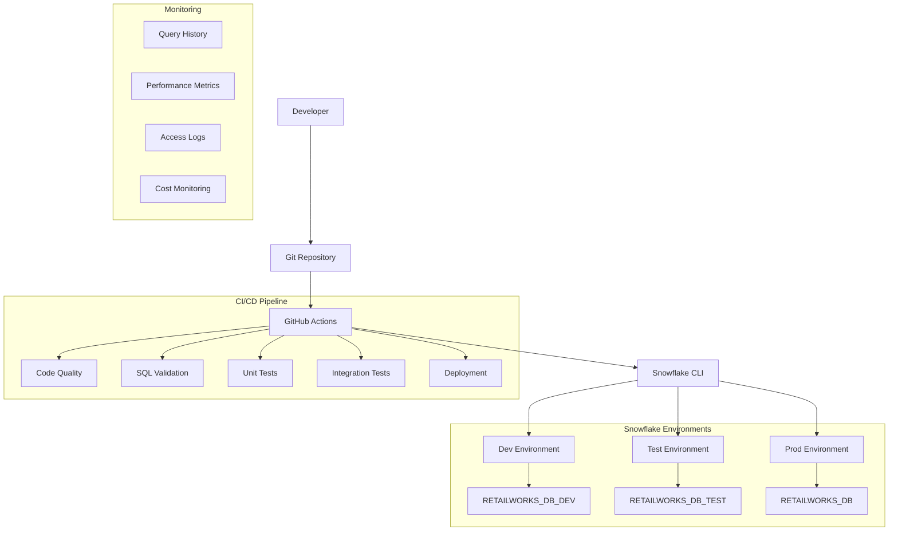

# Snowflake DevOps Implementation Guide

This guide details the implementation of Snowflake's recommended DevOps practices for the RetailWorks Enterprise Data Platform, following the official [Snowflake DevOps documentation](https://docs.snowflake.com/en/developer-guide/builders/devops).

## Table of Contents
- [DevOps Principles](#devops-principles)
- [Architecture Overview](#architecture-overview)
- [Environment Management](#environment-management)
- [Git Integration](#git-integration)
- [CI/CD with GitHub Actions](#cicd-with-github-actions)
- [Snowflake CLI Usage](#snowflake-cli-usage)
- [Template-Driven Development](#template-driven-development)
- [Testing Strategy](#testing-strategy)
- [Deployment Workflows](#deployment-workflows)
- [Monitoring and Observability](#monitoring-and-observability)

## DevOps Principles

Our implementation follows Snowflake's core DevOps principles:

### 1. **Declarative Infrastructure Management**
- Use `CREATE OR ALTER` commands for idempotent deployments
- Infrastructure as Code using SQL and Python
- Version-controlled database objects and configurations

### 2. **Git-Centric Workflow**
- All code, configurations, and documentation in Git
- Branch-based development with automated testing
- Merge-based deployments with approval gates

### 3. **Environment Isolation**
- Separate Snowflake databases for dev, test, and production
- Parameterized deployments using Jinja2 templating
- Environment-specific configuration management

### 4. **Automated Testing**
- Unit tests for database objects and Python code
- Integration tests for end-to-end workflows
- Performance testing for query optimization

### 5. **Continuous Integration/Deployment**
- Automated builds and deployments
- Quality gates and approval processes
- Rollback capabilities and disaster recovery

## Architecture Overview



## Environment Management

### Environment Configuration

Each environment is configured with specific parameters:

**Development Environment**
```yaml
dev:
  database: RETAILWORKS_DB_DEV
  schema_suffix: _DEV
  warehouse: RETAILWORKS_DEV_WH
  role: RETAILWORKS_DEV_ADMIN
  auto_suspend: 60 # seconds
  size: X-SMALL
```

**Test Environment**
```yaml
test:
  database: RETAILWORKS_DB_TEST
  schema_suffix: _TEST
  warehouse: RETAILWORKS_TEST_WH
  role: RETAILWORKS_TEST_ADMIN
  auto_suspend: 300
  size: SMALL
```

**Production Environment**
```yaml
prod:
  database: RETAILWORKS_DB
  schema_suffix: ""
  warehouse: RETAILWORKS_PROD_WH
  role: RETAILWORKS_PROD_ADMIN
  auto_suspend: 600
  size: MEDIUM
```

### Environment Promotion Strategy

1. **Development → Test**: Automated promotion on merge to `develop` branch
2. **Test → Production**: Manual approval required via GitHub environment protection
3. **Hotfixes**: Direct deployment to production with post-deployment validation

## Git Integration

### Branch Strategy

Following GitFlow with Snowflake-specific adaptations:

```
main                    # Production releases
├─ develop             # Integration branch for testing
├─ feature/analytics   # Feature development
├─ feature/ml-models   # ML model development
├─ hotfix/critical     # Production hotfixes
└─ release/v1.2.0     # Release preparation
```

### Git Hooks

Pre-commit hooks ensure code quality:

```bash
# .pre-commit-config.yaml
repos:
  - repo: local
    hooks:
      - id: sql-lint
        name: SQL Linting
        entry: sqlfluff lint --dialect snowflake
        language: system
        files: \.sql$
        
      - id: python-format
        name: Python Formatting
        entry: black
        language: system
        files: \.py$
        
      - id: snowflake-validate
        name: Snowflake SQL Validation
        entry: snow sql --dry-run
        language: system
        files: ddl/.*\.sql$
```

## CI/CD with GitHub Actions

### Workflow Triggers

Our GitHub Actions workflow is triggered by:

1. **Push to main/develop**: Automatic deployment to respective environments
2. **Pull Requests**: Validation and testing only
3. **Manual Dispatch**: On-demand deployment with parameter selection

### Pipeline Stages

#### 1. Code Quality
```yaml
- name: SQL Linting
  run: sqlfluff lint --dialect snowflake ddl/

- name: Python Quality
  run: |
    black --check .
    flake8 . --max-line-length=100
    isort --check-only .
```

#### 2. SQL Validation
```yaml
- name: Validate SQL Syntax
  run: |
    snow sql --dry-run -f ddl/schemas/01_create_database.sql \
      --template-syntax \
      --variable database_name="RETAILWORKS_DB_TEST" \
      --variable schema_suffix="_TEST"
```

#### 3. Deployment
```yaml
- name: Deploy Infrastructure
  run: |
    snow sql -f ddl/schemas/01_create_database.sql \
      --template-syntax \
      --variable database_name="${{ env.DATABASE_NAME }}" \
      --variable schema_suffix="${{ env.SCHEMA_SUFFIX }}" \
      -c retailworks
```

#### 4. Testing
```yaml
- name: Run Integration Tests
  run: |
    pytest snowpark/tests/test_database.py -v
    pytest snowpark/tests/test_etl.py -v
```

## Snowflake CLI Usage

### Installation and Setup

```bash
# Install Snowflake CLI
pip install snowflake-cli-labs

# Create connection
snow connection add retailworks-dev \
  --account your-account \
  --user your-user \
  --password your-password \
  --role RETAILWORKS_DEV_ADMIN \
  --warehouse RETAILWORKS_DEV_WH \
  --database RETAILWORKS_DB_DEV
```

### Key Commands

#### SQL Execution
```bash
# Execute SQL file with templating
snow sql -f ddl/schemas/01_create_database.sql \
  --template-syntax \
  --variable database_name="RETAILWORKS_DB_DEV" \
  --variable schema_suffix="_DEV" \
  -c retailworks-dev

# Dry run validation
snow sql --dry-run -f ddl/tables/sales_schema_tables.sql \
  --template-syntax \
  --variable database_name="RETAILWORKS_DB_DEV" \
  --variable schema_suffix="_DEV" \
  -c retailworks-dev
```

#### Snowpark Deployment
```bash
# Deploy Snowpark function
snow snowpark deploy \
  --project-definition-file snowflake.yml \
  --connection retailworks-dev \
  --replace

# List deployed functions
snow snowpark list -c retailworks-dev
```

#### Streamlit Deployment
```bash
# Deploy Streamlit app
snow streamlit deploy \
  --name executive_dashboard \
  --file streamlit/dashboards/executive_dashboard.py \
  -c retailworks-dev
```

### Custom Deployment Script

Our `deploy_with_cli.sh` script automates common deployment tasks:

```bash
# Deploy everything to dev with sample data
./scripts/deploy_with_cli.sh dev all true false

# Deploy only sales schema to test
./scripts/deploy_with_cli.sh test sales false false

# Validate production deployment (dry run)
./scripts/deploy_with_cli.sh prod all false true
```

## Template-Driven Development

### Jinja2 Templating

All SQL files use Jinja2 templating for environment parameterization:

```sql
-- Before (static)
USE SCHEMA RETAILWORKS_DB.SALES_SCHEMA;

-- After (templated)
USE SCHEMA {{ database_name | default('RETAILWORKS_DB') }}.SALES_SCHEMA{{ schema_suffix | default('') }};
```

### Template Variables

Standard variables used across all templates:

| Variable | Description | Dev | Test | Prod |
|----------|-------------|-----|------|------|
| `database_name` | Target database | `RETAILWORKS_DB_DEV` | `RETAILWORKS_DB_TEST` | `RETAILWORKS_DB` |
| `schema_suffix` | Schema name suffix | `_DEV` | `_TEST` | `` |
| `warehouse_name` | Compute warehouse | `RETAILWORKS_DEV_WH` | `RETAILWORKS_TEST_WH` | `RETAILWORKS_PROD_WH` |
| `environment` | Environment name | `dev` | `test` | `prod` |

### Configuration Management

Environment configurations are managed in `snowflake.yml`:

```yaml
environments:
  dev:
    database: RETAILWORKS_DB_DEV
    schema_suffix: _DEV
    warehouse: RETAILWORKS_DEV_WH
  test:
    database: RETAILWORKS_DB_TEST
    schema_suffix: _TEST
    warehouse: RETAILWORKS_TEST_WH
  prod:
    database: RETAILWORKS_DB
    schema_suffix: ""
    warehouse: RETAILWORKS_PROD_WH
```

## Testing Strategy

### Test Categories

#### 1. **Unit Tests**
- Database schema validation
- Function logic testing
- Data transformation validation

```python
def test_sales_tables_exist(snowflake_connection):
    """Test that all Sales schema tables exist"""
    cursor = snowflake_connection.cursor()
    cursor.execute("SHOW TABLES IN SCHEMA SALES_SCHEMA_TEST")
    tables = [row[1] for row in cursor.fetchall()]
    
    expected_tables = ['ORDERS', 'ORDER_ITEMS', 'SALES_TERRITORIES', 'SALES_REPS']
    for table in expected_tables:
        assert table in tables, f"Table {table} not found"
```

#### 2. **Integration Tests**
- End-to-end workflow testing
- Cross-schema relationship validation
- ETL pipeline testing

```python
def test_order_processing_workflow():
    """Test complete order processing workflow"""
    # Create test customer
    # Create test order
    # Validate order items
    # Check analytics updates
    pass
```

#### 3. **Performance Tests**
- Query execution time validation
- Resource utilization monitoring
- Scalability testing

```sql
-- Performance test query
SELECT 
    COUNT(*) as execution_count,
    AVG(execution_time_ms) as avg_execution_time,
    MAX(execution_time_ms) as max_execution_time
FROM snowflake.account_usage.query_history 
WHERE query_text LIKE '%VW_MONTHLY_SALES_SUMMARY%'
  AND start_time >= CURRENT_TIMESTAMP - INTERVAL '1 hour';
```

### Test Automation

Tests are automatically executed in the CI/CD pipeline:

```yaml
- name: Run Database Tests
  run: |
    pytest snowpark/tests/test_database.py \
      --html=reports/database_tests.html \
      --junitxml=reports/database_tests.xml

- name: Run Performance Tests
  run: |
    snow sql -f tests/performance/query_performance.sql \
      -c retailworks-test
```

## Deployment Workflows

### Development Workflow

1. **Feature Development**
   ```bash
   git checkout -b feature/new-analytics-view
   # Make changes to SQL files
   git add ddl/views/new_analytics_view.sql
   git commit -m "Add new analytics view for customer segmentation"
   ```

2. **Local Testing**
   ```bash
   # Validate SQL syntax
   snow sql --dry-run -f ddl/views/new_analytics_view.sql \
     --template-syntax \
     --variable database_name="RETAILWORKS_DB_DEV" \
     --variable schema_suffix="_DEV"
   
   # Deploy to personal dev environment
   ./scripts/deploy_with_cli.sh dev all false true
   ```

3. **Pull Request**
   ```bash
   git push origin feature/new-analytics-view
   # Create PR - triggers automated validation
   ```

4. **Review and Merge**
   - Code review by team
   - Automated tests pass
   - Merge to develop branch

### Release Workflow

1. **Test Environment Deployment**
   - Automatic deployment on merge to `develop`
   - Integration testing execution
   - Performance validation

2. **Production Preparation**
   ```bash
   git checkout -b release/v1.3.0
   # Update version numbers, documentation
   git commit -m "Prepare release v1.3.0"
   ```

3. **Production Deployment**
   - Manual approval required
   - Blue-green deployment strategy
   - Post-deployment validation

### Rollback Procedures

#### Automatic Rollback
```bash
# Using Git tags
git checkout v1.2.3
./scripts/deploy_with_cli.sh prod all false false
```

#### Manual Rollback
```sql
-- Using Snowflake Time Travel
CREATE OR REPLACE TABLE SALES_SCHEMA.ORDERS 
CLONE SALES_SCHEMA.ORDERS AT(TIMESTAMP => '2024-01-15 10:00:00'::timestamp);
```

## Monitoring and Observability

### Query Performance Monitoring

```sql
-- Monitor slow queries
CREATE OR REPLACE VIEW MONITORING.SLOW_QUERIES AS
SELECT 
    query_id,
    query_text,
    database_name,
    schema_name,
    execution_time,
    warehouse_name,
    user_name,
    start_time
FROM snowflake.account_usage.query_history 
WHERE execution_time > 30000 -- 30 seconds
  AND start_time >= CURRENT_TIMESTAMP - INTERVAL '24 hours'
ORDER BY execution_time DESC;
```

### Cost Monitoring

```sql
-- Monitor warehouse costs
CREATE OR REPLACE VIEW MONITORING.WAREHOUSE_COSTS AS
SELECT 
    warehouse_name,
    DATE(start_time) as usage_date,
    SUM(credits_used) as total_credits,
    SUM(credits_used) * 2.0 as estimated_cost_usd -- Adjust rate
FROM snowflake.account_usage.warehouse_metering_history
WHERE start_time >= CURRENT_TIMESTAMP - INTERVAL '30 days'
GROUP BY warehouse_name, DATE(start_time)
ORDER BY usage_date DESC, total_credits DESC;
```

### Access Monitoring

```sql
-- Monitor data access patterns
CREATE OR REPLACE VIEW MONITORING.DATA_ACCESS_PATTERNS AS
SELECT 
    user_name,
    database_name,
    schema_name,
    table_name,
    COUNT(*) as access_count,
    MAX(query_start_time) as last_access
FROM snowflake.account_usage.access_history
WHERE query_start_time >= CURRENT_TIMESTAMP - INTERVAL '7 days'
GROUP BY user_name, database_name, schema_name, table_name
ORDER BY access_count DESC;
```

### Alerting

GitHub Actions can send notifications on deployment events:

```yaml
- name: Notify Slack on Success
  if: success()
  uses: 8398a7/action-slack@v3
  with:
    status: success
    channel: '#data-platform'
    text: |
      ✅ RetailWorks deployment to ${{ env.ENVIRONMENT }} completed successfully!
      
      📊 Database: ${{ env.DATABASE_NAME }}
      🔗 Commit: ${{ github.sha }}
      👤 Author: ${{ github.actor }}
  env:
    SLACK_WEBHOOK_URL: ${{ secrets.SLACK_WEBHOOK_URL }}
```

## Best Practices

### 1. **SQL Development**
- Use `CREATE OR REPLACE` for idempotent deployments
- Always include proper error handling
- Use meaningful naming conventions
- Add comprehensive comments and documentation

### 2. **Version Control**
- Commit early and often
- Use descriptive commit messages
- Tag releases properly
- Maintain clean Git history

### 3. **Testing**
- Write tests before implementing features
- Maintain high test coverage
- Test with realistic data volumes
- Validate performance regularly

### 4. **Security**
- Use role-based access control
- Implement data masking for sensitive data
- Regularly audit access permissions
- Monitor for suspicious activity

### 5. **Cost Optimization**
- Right-size warehouses for workloads
- Use auto-suspend and auto-resume
- Monitor and optimize query performance
- Implement data retention policies

## Troubleshooting

### Common Issues

#### 1. **Connection Errors**
```bash
# Check connection status
snow connection test -c retailworks-dev

# Update connection
snow connection add retailworks-dev \
  --account your-account \
  --user your-user \
  --overwrite
```

#### 2. **Template Rendering Errors**
```bash
# Validate template syntax
snow sql --dry-run -f your-file.sql \
  --template-syntax \
  --variable key=value
```

#### 3. **Permission Errors**
```sql
-- Check current role and privileges
SELECT CURRENT_ROLE();
SHOW GRANTS TO ROLE CURRENT_ROLE();
```

#### 4. **Performance Issues**
```sql
-- Check warehouse utilization
SELECT * FROM snowflake.account_usage.warehouse_load_history 
WHERE warehouse_name = 'RETAILWORKS_PROD_WH'
  AND start_time >= CURRENT_TIMESTAMP - INTERVAL '1 hour';
```

For additional support and troubleshooting, refer to the [Snowflake Documentation](https://docs.snowflake.com/) and our internal [Troubleshooting Guide](troubleshooting.md).